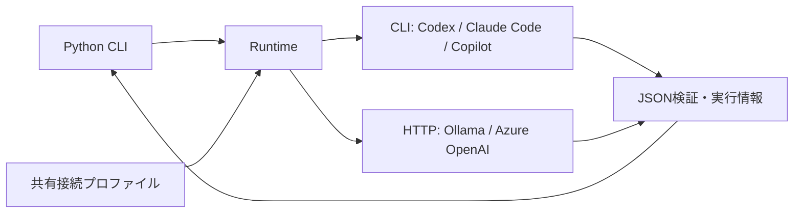

# Tkn GenAI Runtime — Python CLI 共通の生成AI呼び出し

Python で作成した複数の CLI から、同じ API と接続設定で生成AIを呼び出すためのパッケージです。
プロンプトと JSON Schema を渡すと、検証済みの JSON オブジェクトと、モデル・利用量・実行時間の情報を返します。

例えば「文章を要約し、summary に入れて返す」という要求を、接続プロファイルの変更で Codex、Claude Code、GitHub Copilot、Ollama、Azure OpenAI に切り替えられます。
次は結果の説明例です。実際の生成文と利用量は接続先によって変わります。

```json
{"summary": "火曜日に新機能を公開し、金曜日に利用者の意見を確認します。"}
```

初めて使う場合は「セットアップ」から「Python CLI に組み込む」まで進めてください。
設定の全項目は [設定仕様](docs/reference/configuration.md)、既存実装の切り出し方は [移行ガイド](docs/guides/migration.md) にまとめています。

## 担当する範囲

| 共通パッケージ | 利用する CLI |
| --- | --- |
| 接続先の選択、共通設定、認証方法、通信・外部プロセス | 入力ファイルの選択、分割・統合、用途に合ったプロンプト |
| タイムアウト、例外、JSON Schema 検証、実行情報 | 出典との照合、Markdown への整形、保存・再開、処理全体の予算 |

以下の矢印は呼び出し関係です。
接続プロファイルはモデル・接続先・認証方法をまとめた設定で、出力内容を定義するプロンプトやスキーマとは別に管理します。



常駐サーバーは不要です。
接続先への呼び出しをこの Python パッケージに集約します。
HTTP 接続は httpx を使い、現在の5種類に必要なアダプターを実装しています。

## セットアップ

Python 3.11 以上と [uv](https://docs.astral.sh/uv/) が必要です。
Windows を主対象にしています。
利用する接続先の CLI またはサーバーを別途導入し、認証やモデルの準備を済ませてください。

### 補助CLIをインストールする

設定管理や単独実行に使う `tkn-genai` をインストールします。
例のパスを、このリポジトリを置いたフォルダに置き換えてください。

```powershell
cd "C:\path\to\tkn_genai_runtime"
uv tool install .
tkn-genai --help
```

Azure の Microsoft Entra ID 認証を使う場合は、追加依存を含めてインストールします。
API キー認証だけの場合、追加依存は不要です。

```powershell
uv tool install ".[azure]" --reinstall
```

これは補助CLIの専用環境へのインストールです。
自分の Python CLI から import する場合は、後述のとおり、そのプロジェクトにも依存関係を追加します。

### 共有設定を用意する

```powershell
tkn-genai config init --dry-run
tkn-genai config init
tkn-genai config show --no-project-config
```

`config init` は `~/.tkn/genai/config.yaml` を作成し、絶対パスと作成結果を表示します。
同じ内容なら `unchanged`、編集済みならエラーで停止して既存ファイルを保持します。
作成したファイルを編集し、利用する接続プロファイルを追加してください。

初期設定は `codex-default` です。
Codex CLI のログイン済み認証を使い、モデルは CLI の既定値を使います。
モデルを固定したい場合は、その環境で利用可能なモデル名を `model` に指定します。
共有設定の具体例は [設定仕様](docs/reference/configuration.md) を参照してください。

## 最初の実行と結果確認

リポジトリ直下の匿名サンプルで、設定・入力・実行ファイルを確認します。

```powershell
tkn-genai generate --no-project-config --profile codex-default --prompt-file examples/prompt.txt --schema-file examples/output.schema.json --dry-run
```

dry-run は通信、認証、生成AIの呼び出し、ファイル作成を行いません。
認証状態やモデルの利用可否、サーバー側のスキーマ対応は、本実行で確認されます。
`will_call_provider: false` と終了コード `0` が入力検証成功の目印です。

**次の通常実行はプロンプトとスキーマを接続先へ送り、API料金やサービスの利用枠を消費する場合があります。**
`--dry-run` を外して実行します。

```powershell
tkn-genai generate --no-project-config --profile codex-default --prompt-file examples/prompt.txt --schema-file examples/output.schema.json
```

標準出力の JSON の `data` に検証済みの結果、`record` に実行情報が入ります。
標準エラーには進捗と `[SUCCESS]` を表示します。
生成結果は自動保存しません。保存先と上書きの判断は呼び出し元が担当します。

再実行すると毎回新しい生成要求を送ります。
パッケージは自動再試行、別接続先への切り替え、生成結果のキャッシュを行いません。
失敗時は `error.code` を確認し、認証・設定・モデル・入力を修正してください。
タイムアウトや通信断では、接続先で処理が完了したか、料金が発生したか分からないことがあります。

## Python CLI に組み込む

### 利用側プロジェクトに追加する

ローカル開発では、利用側のプロジェクトで次のように追加します。

```powershell
cd "C:\path\to\your_cli"
uv add "C:\path\to\tkn_genai_runtime"
uv run python -c "import tkn_genai_runtime; print(tkn_genai_runtime.__version__)"
```

これは通常のインストールです。
開発用の直接参照が必要な場合だけ `uv add --editable` を使います。
公開する利用側リポジトリには、個人環境の絶対パスを含む依存設定を残さないでください。
配布用には [uv の Git 依存](https://docs.astral.sh/uv/concepts/projects/dependencies/#git) で実際のリポジトリURLとタグ・コミットを指定するか、ビルドした wheel を使ってください。
このプロジェクトは PyPI への公開を前提としていません。

### 最小の呼び出しコード

```python
from tkn_genai_runtime import GenerationRequest, Runtime, load_profile

runtime = Runtime(load_profile("codex-default"))
request = GenerationRequest(
    prompt="「火曜日に公開し、金曜日に意見を確認する」を一文で要約してください。",
    output_schema={
        "type": "object",
        "properties": {"summary": {"type": "string"}},
        "required": ["summary"],
        "additionalProperties": False,
    },
)
print(runtime.plan(request).model_dump())  # 通信せずに検証
result = runtime.generate(request)  # 生成AIを呼び出す
print(result.data["summary"])
print(result.record.model_dump())
```

ライブラリの `load_profile()` は共有設定と明示された追加ファイルを読み込みます。
利用側CLIの `./.tkn/config.yaml` は自動では読みません。
利用側で `genai_profile` などの選択項目を定義し、その値を `load_profile()` に渡してください。
その回だけの変更は `load_profile("codex-default", overrides={"model": "your-model"})` のように指定できます。

実用のプロンプトとスキーマは利用側パッケージのリソースに置いてください。
実行できるサンプルは [examples/use_runtime.py](examples/use_runtime.py)、例外と結果の契約は [Python API](docs/reference/api.md) にあります。

## コマンド一覧

共通の `--quiet` / `--verbose` はコマンドの前に指定し、同時には使えません。
各コマンドの設定オプションはコマンドの後に指定します。

| 目的 | コマンド | 結果・副作用 |
| --- | --- | --- |
| 設定の作成 | `tkn-genai config init [--path PATH] [--dry-run]` | 通常は設定ファイルを新規作成 |
| 設定元と最終値の確認 | `tkn-genai config show [--config PATH] [--profile NAME]` | 読み取りのみ。認証情報の値は解決しない |
| 生成 | `tkn-genai generate --prompt-file PATH --schema-file PATH` | 接続先へ送信し、JSON を表示 |
| 生成前の確認 | 上記に `--dry-run` を追加 | 通信・認証・書き込みなし |
| バージョン確認 | `tkn-genai --version` | インストール済みの版を表示 |

設定確認と生成には `--profile`、`--model`、`--reasoning-effort`、`--timeout-seconds`、`--no-project-config` も使えます。
引数エラーは終了コード `2`、生成失敗は非 `0`、正常終了は `0` です。

## 対応範囲と注意点

| 接続先 | 方式 | 事前に用意するもの |
| --- | --- | --- |
| Codex | `codex exec` | 対応オプションを持つスタンドアロンCLIとログイン |
| Claude Code | `claude -p` | CLIと認証 |
| GitHub Copilot | 標準入力＋silent出力 | CLIと認証 |
| Ollama | ローカル `/api/chat` | サーバーと取得済みモデル |
| Azure OpenAI | v1 Chat Completions | endpoint、デプロイ名、APIキーまたはEntra認証 |

JSON Schema は Draft 2020-12 のオブジェクトを受け付け、生成後に元のスキーマで検証します。
接続先が対応するスキーマの範囲は異なります。
このパッケージは制約を自動で削除しません。
構造が正しくても内容の正しさや出典との一致は利用側で検証してください。

`local_only: true` は Ollama だけに許可し、ループバック接続、プロキシ無効化、リダイレクト拒否、モデル情報の確認を行います。
Ollama 側でもクラウド機能を無効化して使ってください。
[Ollama公式の設定方法](https://docs.ollama.com/faq#how-do-i-disable-ollama-cloud-features) を参照してください。
ローカルサーバー自体の通信を、このパッケージだけで遮断することはできません。

CLI接続は専用の一時フォルダで実行し、終了時にパッケージの一時ファイルを削除します。
外部CLI自身の認証情報、ログ、キャッシュは各製品が管理します。
エージェント製品の完全な隔離環境を提供するものではありません。

自動テストでは通信・外部CLIを置き換え、5種類の要求形式とエラー処理を確認します。
実サービスでの生成、課金、認証、品質と Linux の実動作は未検証です。
外部CLIのオプション変更による影響は [接続仕様](docs/reference/providers.md) を参照してください。

## 更新・開発・検証

補助CLIを更新する場合は、更新済みリポジトリで再インストールします。

```powershell
cd "C:\path\to\tkn_genai_runtime"
uv tool install . --reinstall
tkn-genai --version
```

各アプリケーションは別々の環境に依存パッケージを持つため、共通パッケージを編集しただけでは更新されません。
利用側で依存バージョンを更新してロックファイルを確認し、利用側CLIも再インストールしてください。

開発環境の作成と確認は次の手順です。

```powershell
cd "C:\path\to\tkn_genai_runtime"
uv sync --locked --all-extras
uv run pytest
uv run ruff check .
uv run mypy src
uv build
```

ソースは `src/tkn_genai_runtime/`、テストは `tests/`、配布する設定と指示文は `src/tkn_genai_runtime/resources/` にあります。
テストはフレームワークが管理する一時領域を使い、実際の共有設定を変更しません。

## 関連資料

- [設定仕様と接続プロファイル例](docs/reference/configuration.md)
- [Python API・失敗時の扱い](docs/reference/api.md)
- [プロバイダーごとの接続仕様と公式資料](docs/reference/providers.md)
- [既存CLIからの移行手順](docs/guides/migration.md)
- [変更履歴](CHANGELOG.md)
- [MIT License](LICENSE)

日本語 README を主文書としています。
設計では「生成AIスクリプト開発基本方針」と「CLIリポジトリREADME執筆ガイドライン」を参照し、共通ライブラリと補助CLIの役割に合わせて適用しています。
