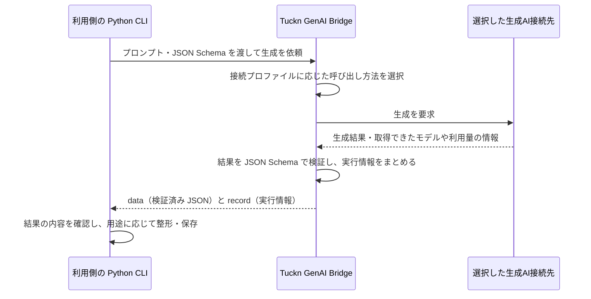
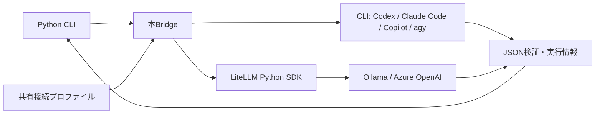

# Tuckn GenAI Bridge — Python CLI 共通の生成AI呼び出し

Python で作成した複数の CLI から、同じ API と接続設定で生成AIを呼び出すためのパッケージです。
プロンプトと JSON Schema を渡すと、検証済みの JSON オブジェクトと、モデル・利用量・実行時間の情報を返します。
生成前のtoken概算と、設定した参考単価によるコスト概算も通信なしで計算できます。

利用側の CLI は、プロンプトと期待する出力形式（JSON Schema）を用意し、接続プロファイルを指定して Bridge を呼び出します。
接続プロファイルを変えることで、同じ呼び出し方で Codex、Claude Code、GitHub Copilot、Google Antigravity（agy）、Ollama、Azure OpenAI を利用できます。
正常に生成・検証できた場合の流れは次のとおりです。



初めて使う場合は「セットアップ」から「Python CLI に組み込む」まで進めてください。
既存アプリへの導入は「[既存の生成処理を置き換える](#既存の生成処理を置き換える)」、設定の全項目は [設定仕様](docs/reference/configuration.md)、バージョンごとの変更と互換性は [変更履歴](CHANGELOG.md) を参照してください。

## 担当する範囲

| Tuckn GenAI Bridgeの担当範囲                         | 本パッケージを利用する側の担当範囲                     |
| ---------------------------------------------------- | ------------------------------------------------------ |
| 接続先の選択、共通設定、認証方法、通信・外部プロセス | 入力ファイルの選択、分割・統合、用途に合ったプロンプト |
| タイムアウト、例外、JSON Schema 検証、実行情報       | 出典との照合、Markdown への整形、保存・再開            |
| token概算、参考単価の設定、tokenからの金額計算       | 許容額・回数・tokenの上限、実行可否、処理全体の予算    |

以下の矢印は呼び出し関係です。
接続プロファイルはモデル・接続先・認証方法をまとめた設定で、出力内容を定義するプロンプトやスキーマとは別に管理します。



常駐サーバーは不要です。
接続先への呼び出しをこの Python パッケージに集約します。
Ollama と Azure OpenAI への生成要求には [LiteLLM Python SDK](https://docs.litellm.ai/docs/) を使います。
共通パッケージが設定・認証・ローカル限定の確認・出力検証・実行記録を担当し、LiteLLM が API ごとの要求形式と呼び出しを担当します。
Codex・Claude Code・GitHub Copilot・Google Antigravity は CLI アダプターで呼び出します。
LiteLLM Proxy や Docker の起動、各 CLI での LiteLLM の直接利用は不要です。

## セットアップ

Python 3.11 以上と [uv](https://docs.astral.sh/uv/) が必要です。
動作確認は Windows のみです。コマンドプロンプト（CMD）や Linux での実動作は未確認です。
利用する接続先の CLI または生成AIサーバーを別途導入し、認証やモデルの準備を済ませてください。

### 補助CLIをインストールする

設定管理や単独実行に使う `tkn-genai-bridge` をインストールします。
コマンドはターミナルで実行します。パスの例は Windows 形式なので、利用環境に合わせて実際のフォルダのパスに置き換えてください。

```Shell
cd "C:\path\to\tkn_genai_bridge"
uv tool install .
tkn-genai-bridge --help
```

Azure OpenAI の API キー認証と Microsoft Entra ID 認証（ブラウザー認証を含む）に必要なライブラリも、このインストールに含まれます。
認証方法によってインストール手順を変える必要はありません。

これは補助CLIの専用環境へのインストールです。
自分の Python CLI から import する場合は、後述のとおり、そのプロジェクトにも依存関係を追加します。

### 設定を行う

```Shell
tkn-genai-bridge config init --dry-run
tkn-genai-bridge config init
tkn-genai-bridge config show --no-project-config
```

`config init` は `~/.tkn/genai_bridge/config.yaml` を作成し、絶対パスと作成結果を表示します。
同じ内容なら `unchanged`、編集済みならエラーで停止して既存ファイルを保持します。
作成したファイルを編集し、利用する接続プロファイルを追加してください。

初期設定は `codex-default` です。
Codex CLI のログイン済み認証を使い、モデルは CLI の既定値を使います。
モデルを固定したい場合は、その環境で利用可能なモデル名を `model` に指定します。
共有設定の具体例は [設定仕様](docs/reference/configuration.md) を参照してください。
Google Antigravity CLI を使う場合は、事前に `agy` でログインし、`--profile antigravity-default` を指定します。
`model: null` は agy の既定モデルを使い、固定する場合は `agy models` でモデル名を確認します。

### Claude Codeでログインする

Claude Codeを使う場合は、Bridgeを実行するのと同じOSユーザーのターミナルで認証します。
claude.aiアカウントを使う場合の初回ログイン、または認証が無効になった場合の再ログインは次のコマンドです。

```Shell
claude auth login --claudeai
claude auth status
```

ブラウザーでログインし、認証コードが表示された場合は、コマンドを実行したターミナルへ貼り付けてください。
認証コードやトークンをBridgeの設定ファイルに書く必要はありません。
`claude auth status` の `loggedIn: true` やCLI画面の表示だけでは、実際の生成が成功する保証にはなりません。
次節の実行例では `--profile claude-default` を指定し、サンプルで確認してください。
正常に生成できていれば、毎回ログインする必要はありません。

詳しい確認手順と失敗時の切り分けは [Claude Codeのログインと動作確認](docs/reference/providers.md#claude-codeのログインと動作確認) を参照してください。

## 最初の実行と結果確認

リポジトリ直下の匿名サンプルで、設定・入力・実行ファイルを確認します。

```Shell
tkn-genai-bridge generate --no-project-config --profile codex-default --prompt-file examples/prompt.txt --schema-file examples/output.schema.json --dry-run
```

dry-run は通信、認証、生成AIの呼び出し、ファイル作成を行いません。
設定確認と dry-run では LiteLLM SDK も読み込みません。
認証状態やモデルの利用可否、サーバー側のスキーマ対応は、本実行で確認されます。
`will_call_provider: false` と終了コード `0` が入力検証成功の目印です。

**次の通常実行はプロンプトとスキーマを接続先へ送り、API料金やサービスの利用枠を消費する場合があります。**
`--dry-run` を外して実行します。

```Shell
tkn-genai-bridge generate --no-project-config --profile codex-default --prompt-file examples/prompt.txt --schema-file examples/output.schema.json
```

標準出力の JSON の `data` に検証済みの結果、`record` に実行情報が入ります。
標準エラーには進捗と `[SUCCESS]` を表示します。
生成結果は自動保存しません。保存先と上書きの判断は呼び出し元が担当します。

再実行すると毎回新しい生成要求を送ります。
パッケージは自動再試行、別接続先への切り替え、生成結果のキャッシュを行いません。
失敗時は `error.code` を確認し、認証・設定・モデル・入力を修正してください。
HTTPエラーでは `error.http_status` と `error.retry_after_seconds` から状態コードと待機目安を取得できます。
待機・再試行の実行判断は利用側で行います。
タイムアウトや通信断では、接続先で処理が完了したか、料金が発生したか分からないことがあります。

## Python CLI に組み込む

### 利用側プロジェクトに追加する

ローカル開発では、利用側のプロジェクトで次のように追加します。

```Shell
cd "C:\path\to\your_cli"
uv add "C:\path\to\tkn_genai_bridge"
uv run python -c "import tkn_genai_bridge; print(tkn_genai_bridge.__version__)"
```

これは通常のインストールです。
開発用の直接参照が必要な場合だけ `uv add --editable` を使います。
公開する利用側リポジトリには、個人環境の絶対パスを含む依存設定を残さないでください。
配布用には [uv の Git 依存](https://docs.astral.sh/uv/concepts/projects/dependencies/#git) で実際のリポジトリURLとタグ・コミットを指定するか、ビルドした wheel を使ってください。
このプロジェクトは PyPI への公開を前提としていません。

### 最小の呼び出しコード

```python
from tkn_genai_bridge import GenerationRequest, Runtime, load_profile

request = GenerationRequest(
    prompt="「火曜日に公開し、金曜日に意見を確認する」を一文で要約してください。",
    output_schema={
        "type": "object",
        "properties": {"summary": {"type": "string"}},
        "required": ["summary"],
        "additionalProperties": False,
    },
)
with Runtime(load_profile("codex-default")) as runtime:
    print(runtime.plan(request).model_dump())  # 通信せずに検証
    result = runtime.generate(request)  # 生成AIを呼び出す
print(result.data["summary"])
print(result.record.model_dump())
```

連続生成では同じ `Runtime` を使い、ループの外側を `with` で囲みます。
Azureの認証オブジェクトを再利用し、終了時に解放します。明示的な `runtime.close()` も使えます。
失敗時も、取得済みのモデル情報・利用量は `GenAIError.record` から確認できます。
記録と dry-run の結果には、Bridgeのバージョン、使用プロファイル名、認証情報を除く生成条件のハッシュが含まれます。

ライブラリの `load_profile()` は共有設定と明示された追加ファイルを読み込みます。
利用側CLIの `./.tkn/config.yaml` は自動では読みません。
利用側で `genai_profile` などの選択項目を定義し、その値を `load_profile()` に渡してください。
その回だけの変更は `load_profile("codex-default", overrides={"model": "your-model"})` のように指定できます。

実用のプロンプトとスキーマは利用側パッケージのリソースに置いてください。
実行できるサンプルは [examples/use_runtime.py](examples/use_runtime.py)、例外と結果の契約は [Python API](docs/reference/api.md) にあります。

### 既存の生成処理を置き換える

既存アプリに導入する開発者は、接続先への呼び出し部分を `Runtime` に置き換えます。
入力の加工、内容・出典の検証、予算管理、保存・再開は利用側に保持します。

1. 利用側の依存関係に Bridge を追加し、使用するバージョンを固定します。
2. 接続先・モデル・認証を [接続プロファイル](docs/reference/configuration.md) に設定し、利用側から選択できるようにします。アプリ固有の設定は利用側に残します。
3. 生成前の確認には `plan()`、本実行には `generate()` を使います。dry-run では `plan()` までにとどめ、本実行の直前に利用側の予算・回数上限を確認します。
4. `result.data` の内容を元データと照合してから、既存の保存処理へ渡します。`result.record` と失敗時の `GenAIError.record` は、利用側の記録形式に合わせて保存します。
5. 匿名の入力・応答で、生成結果、失敗、利用量の記録、再開動作を確認します。実サービスでの確認は送信可能な入力と費用を確認してから行い、利用側CLIを再インストールします。

戻り値・失敗記録・再生成判定の詳細は [Python API](docs/reference/api.md)、予算確認に使う値は [token・コスト概算](docs/reference/costs.md) を参照してください。

## token・コストを確認する

`runtime.plan(request)` は `token_estimate` と `cost_estimate` を返します。
入力tokenは、プロンプト・スキーマなどのUTF-8バイト数に余裕分を加えた粗い概算です。
出力tokenは `max_output_tokens`、または `plan(request, output_tokens=1000)` の仮定値を使います。
実際の使用量や料金の上限を保証する値ではありません。
独自tokenizerや既存CLIの推定は、`plan(request, input_tokens=4200, input_tokens_method="local-tokenizer-v1")`
で渡せます。Bridgeは余裕分を追加せず、指定値と推定方法を計画に残します。

参考単価は、共有設定の `profiles.<name>.pricing.<model>` に通貨・基準日・100万tokenあたりの価格を設定します。
Azureではモデル名の代わりにデプロイ名をキーにします。単価の取得・更新や為替換算は行いません。
設定例と詳しい計算方法は [コスト概算](docs/reference/costs.md) を参照してください。

生成後は `result.record.usage` に取得できたtoken数、`result.record.cost_estimate` に参考額が入ります。
`usage.completeness` で全体が判明したかを区別し、途中失敗で判明した分は `usage.known_subtotal` に残します。
部分利用量の総量・全額は不明として扱います。
料金を更新しても保存済みのtoken数から `estimate_cost(usage, pricing)` で再計算できます。
金額を計算できない場合は `amount: null` と理由を返します。未設定を無料とは扱いません。
実行するか、上限超過で止めるかは利用側CLIが決めます。

補助CLIの `generate --dry-run` でも同じ情報を表示します。
`--estimate-output-tokens 1000` を追加すると、生成設定を変えずに出力tokenの仮定値を指定できます。

## コマンド一覧

共通の `--quiet` / `--verbose` はコマンドの前に指定し、同時には使えません。
各コマンドの設定オプションはコマンドの後に指定します。

| 目的                 | コマンド                                                            | 結果・副作用                           |
| -------------------- | ------------------------------------------------------------------- | -------------------------------------- |
| 設定の作成           | `tkn-genai-bridge config init [--path PATH] [--dry-run]`          | 通常は設定ファイルを新規作成           |
| 設定元と最終値の確認 | `tkn-genai-bridge config show [--config PATH] [--profile NAME]`   | 読み取りのみ。認証情報の値は解決しない |
| 生成                 | `tkn-genai-bridge generate --prompt-file PATH --schema-file PATH` | 接続先へ送信し、JSON を表示            |
| 生成前の確認         | 上記に`--dry-run` を追加                                          | 通信・認証・書き込みなし               |
| バージョン確認       | `tkn-genai-bridge --version`                                      | インストール済みの版を表示             |

dry-run専用の `--estimate-input-tokens` / `--estimate-output-tokens` は0以上の整数です。
`--estimate-input-method` は入力推定値と併用し、その推定方法名を記録できます。
設定確認と生成には `--profile`、`--model`、`--reasoning-effort`、`--timeout-seconds`、`--no-project-config` も使えます。
引数エラーは終了コード `2`、生成失敗は非 `0`、正常終了は `0` です。

## 対応範囲と注意点

| 接続先             | 方式                                 | 事前に用意するもの                                 |
| ------------------ | ------------------------------------ | -------------------------------------------------- |
| Codex              | `codex exec`                       | 対応オプションを持つスタンドアロンCLIとログイン    |
| Claude Code        | `claude -p`                        | CLIと[ログイン済み認証](#claude-codeでログインする) |
| GitHub Copilot     | 標準入力＋silent出力                 | CLIと認証                                          |
| Google Antigravity | `agy` のNDJSON入出力               | CLIとログイン済み認証                              |
| Ollama             | LiteLLM SDK → ローカル`/api/chat` | サーバーと取得済みモデル                           |
| Azure OpenAI       | LiteLLM SDK → v1 Chat Completions   | endpoint、デプロイ名、APIキーまたはEntra認証       |

JSON Schema は Draft 2020-12 のオブジェクトを受け付け、生成後に元のスキーマで検証します。
接続先が対応するスキーマの範囲は異なります。
このパッケージは制約を自動で削除しません。
LiteLLM への切り替えで、設定の `provider` や `model` に接頭辞を追加する必要はありません。
本パッケージが公開する接続先は上記の6種類です。LiteLLM の全プロバイダーを直接指定する設定は提供しません。
構造が正しくても内容の正しさや出典との一致は利用側で検証してください。

`local_only: true` は Ollama だけに許可し、ループバック接続、プロキシ無効化、リダイレクト拒否、モデル情報の確認を行います。
Ollama 側でもクラウド機能を無効化して使ってください。
[Ollama公式の設定方法](https://docs.ollama.com/faq#how-do-i-disable-ollama-cloud-features) を参照してください。
ローカルサーバー自体の通信を、このパッケージだけで遮断することはできません。

CLI接続は専用の一時フォルダで実行し、終了時にパッケージの一時ファイルを削除します。
外部CLI自身の認証情報、ログ、キャッシュは各製品が管理します。
エージェント製品の完全な隔離環境を提供するものではありません。

自動テストでは通信・外部CLIを置き換え、6種類の要求形式とエラー処理を確認します。
API接続は実際の LiteLLM SDK と匿名の応答を使い、外部通信を拒否したプロセスでも確認します。
2026-09-25にWindowsで全6種類の認証・サンプル生成・JSON検証を確認しました。詳細は [接続仕様](docs/reference/providers.md#cli接続) を参照してください。
実請求額との照合、用途ごとの出力品質と Linux の実動作は未検証です。
外部CLIのオプション変更による影響は [接続仕様](docs/reference/providers.md) を参照してください。

LiteLLM は API 生成時に遅延読み込みします。初回の読み込み時間と追加の依存パッケージが必要です。
SDK の価格表・トークナイザーは同梱データを使い、SDKログ・外部コールバック・自動切り替えを使わない設定で動作します。
この初期化にはプロセス全体へ適用される設定があるため、利用側で LiteLLM を別途初期化せず、このパッケージに任せてください。
詳細は [LiteLLM の利用範囲](docs/reference/providers.md#litellm-python-sdk) を参照してください。

## 更新・開発・検証

補助CLIを更新する場合は、更新済みリポジトリで再インストールします。

```Shell
cd "C:\path\to\tkn_genai_bridge"
uv tool install . --reinstall
tkn-genai-bridge --version
```

各アプリケーションは別々の環境に依存パッケージを持つため、共通パッケージを編集しただけでは更新されません。
利用側で依存バージョンを更新してロックファイルを確認し、利用側CLIも再インストールしてください。
更新前に [変更履歴](CHANGELOG.md) の対象バージョンを読み、設定・保存済み記録・読み取り処理への影響を確認してください。

開発環境の作成と確認は次の手順です。

```Shell
cd "C:\path\to\tkn_genai_bridge"
uv sync --locked
uv run pytest
uv run ruff check .
uv run mypy src
uv build
```

> **VS Code で開発する場合**：ターミナルで `.venv` が自動有効化されることがありますが、`uv run` の利用に有効化は不要です。
> 有効化中は開発用 CLI が優先されるため、`uv tool install . --reinstall` で更新した CLI の動作確認は、`deactivate` で解除してから行ってください。

ソースは `src/tkn_genai_bridge/`、テストは `tests/`、配布する設定と指示文は `src/tkn_genai_bridge/resources/` にあります。
テストはフレームワークが管理する一時領域を使い、実際の共有設定を変更しません。

## 関連資料

- [設定仕様と接続プロファイル例](docs/reference/configuration.md)
- [Python API・失敗時の扱い](docs/reference/api.md)
- [token・コスト概算と単価設定](docs/reference/costs.md)
- [プロバイダーごとの接続仕様と公式資料](docs/reference/providers.md)
- [変更履歴](CHANGELOG.md)
- [MIT License](LICENSE)

日本語 README を主文書としています。
設計では「生成AIスクリプト開発基本方針」と「CLIリポジトリREADME執筆ガイドライン」を参照し、共通ライブラリと補助CLIの役割に合わせて適用しています。
